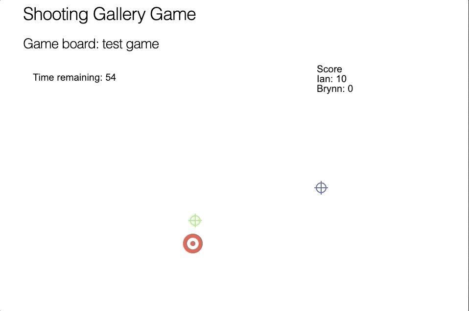

# Shooting Gallery

This project was completed by Ian Anderson and Madeline Seraphin for our CS 4550 Web Development course. We created a Shooting Gallery game, inspired by the one on Wii Play, that can be played by two players simultaneously on different browsers. We utilized Web Sockets to make this live-updating game work.

To start your Phoenix server:

  * Install dependencies with `mix deps.get`
  * Install Node.js dependencies with `cd assets && npm install`
  * Start Phoenix endpoint with `mix phx.server`

Now you can visit [`localhost:4000`](http://localhost:4000) from your browser.

Ready to run in production? Please [check our deployment guides](https://hexdocs.pm/phoenix/deployment.html).

## Learn more

  * Official website: http://www.phoenixframework.org/
  * Guides: https://hexdocs.pm/phoenix/overview.html
  * Docs: https://hexdocs.pm/phoenix
  * Mailing list: http://groups.google.com/group/phoenix-talk
  * Source: https://github.com/phoenixframework/phoenix
